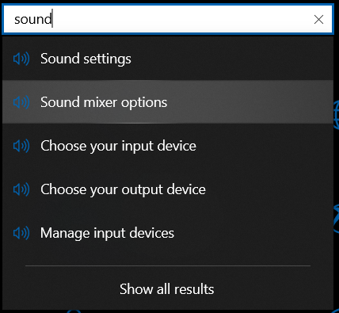
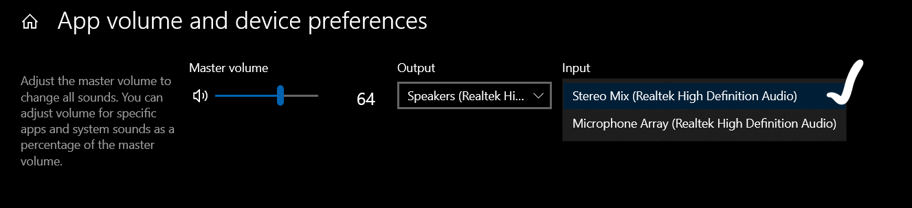

# Setup

1. Open ```Settings``` then type ```Sound```. Select ```Sound Mixer``` option



2. Select ```Stereo Mix``` from drop down menu of ```Input```



3. Pin Chrome on Taskbar at 2nd position.


## Now you are good to go

# How to run?

```pip install -r reuquirements.txt``` : Install all the dependencies

```python Automation.py``` : Run the pyhton file